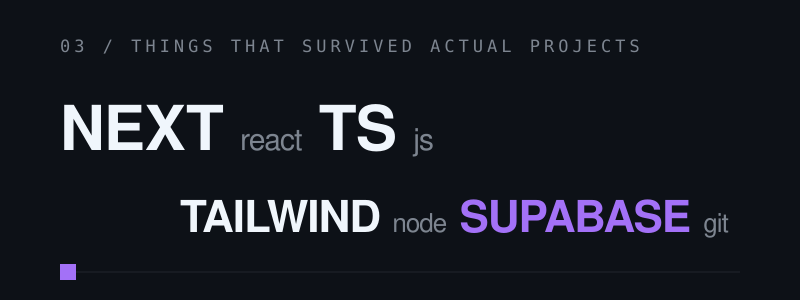

<!-- 00 / HERO -->

 

<!-- 01 / SIGNAL -->

 

<!-- 02 / SELECTED WORK -->

 

<!-- 03 / TOOLBOX -->

 

<!-- 04 / END -->

  <a href="https://github.com/Kayzenn123">GITHUB</a>
  &nbsp;&nbsp;/&nbsp;&nbsp;
  <a href="https://instagram.com/zennecto">INSTAGRAM</a>
  &nbsp;&nbsp;/&nbsp;&nbsp;
  <a href="https://twitter.com/zennnectoo">X</a>

