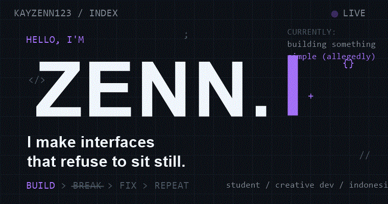
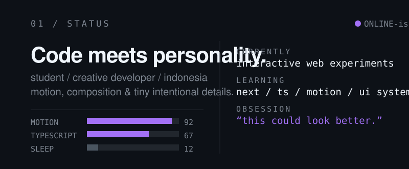
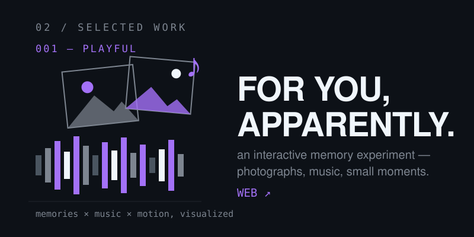
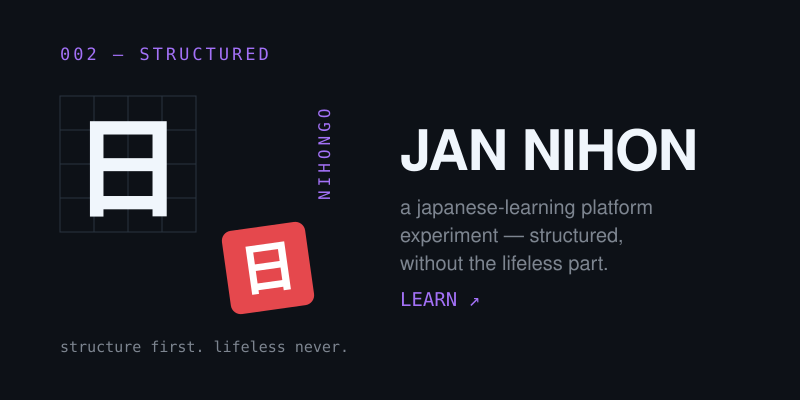
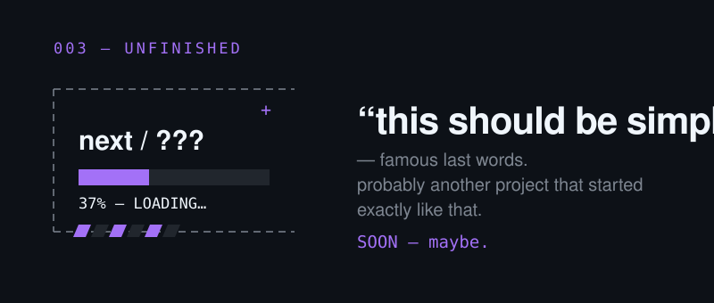
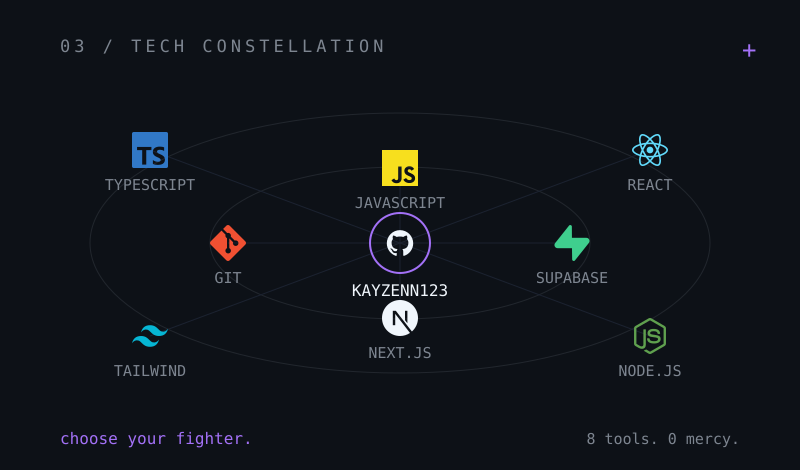

<!-- 00 / HERO — animated -->

 

<!-- 01 / STATUS -->

 

<!-- 02 / SELECTED WORK -->

 

<!-- 03 / TECH CONSTELLATION -->

 

<!-- 04 / ON GITHUB -->

  
  &nbsp;
  <code>@Kayzenn123 — every commit is a plot twist.</code>
  &nbsp;&nbsp;
  <a href="https://github.com/Kayzenn123?tab=repositories">repositories →</a>

 

<!-- 05 / CONNECT -->

  
  <code>Kayzenn123</code>
  &nbsp;&nbsp;&nbsp;
  
  <code>zennecto</code>
  &nbsp;&nbsp;&nbsp;
  
  <code>zennnectoo</code>

 

<!-- 06 / END -->

